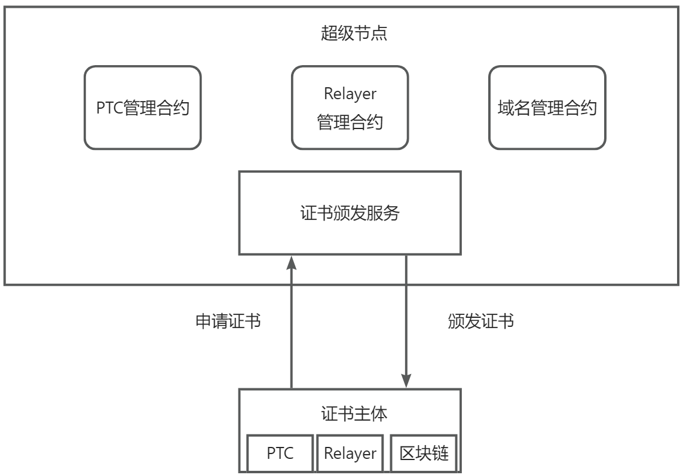

<div align="center">
  <h1 align="center">BCDNS Credential Server</h1>
  <p align="center">
    <a href="http://makeapullrequest.com">
      
    </a>
    <a href="https://www.java.com">
      
    </a>
    <a href="https://www.apache.org/licenses/LICENSE-2.0">
      
    </a>
  </p>
</div>

# 介绍
区块链域名系统（BlockChain Domain Name System, BCDNS），是按照[IEEE 3205](https://antchainbridge.oss-cn-shanghai.aliyuncs.com/antchainbridge/document/ieee/p3205/IEEE_3205-2023_Final.pdf)跨链标准中的身份协议实现的证书颁发服务，负责给跨链系统中的证明转化组件（PTC）、中继服务器（Relayer）、和区块链域名赋予唯一性标识和可信证书，以实现跨链互操作过程中的身份认证。

BCDNS将功能实现分为两部分，分别为凭证颁发和凭证上链，PTC、Relayer和区块链域名主体等在发起证书申请后，由发证方负责审核并颁发证书，同时证书信息会由发证方上传至星火主链证书管理合约（PTC管理合约、Relayer管理合约、域名管理合约）中进行记录保存。

# 架构



区块链域名系统向网络提供权威服务，包括域名签发、跨链身份凭证、网络路由等功能。

- 证书颁发服务：证书颁发服务是由星火·链网超级节点负责运行的一个链下服务，为PTC、Relayer、域名颁发VC。
- 证书主体：VC针对的主体，用bid地址唯一标识。
- PTC管理合约：存储PTC发证方颁发的数字证书列表。
- Relayer管理合约：存储Relayer发证方颁发的数字证书列表，以及域名和Relayer的路由映射关系、域名和TB-BTA的映射关系。
- 域名管理合约：存储区块链域名发证方颁发的数字证书列表。

# 快速开始

## 部署BCDNS

### 环境

BCDNS使用了MySQL和Redis，这里建议使用docker快速安装依赖。

首先通过脚本安装docker，或者在[官网](https://docs.docker.com/get-docker/)下载。

```bash
wget -qO- https://get.docker.com/ | bash
```

然后下载MySQL镜像并启动容器：

```bash
docker run -itd --name mysql-test -p 3306:3306 -e MYSQL_ROOT_PASSWORD='YOUR_PWD' mysql --default-authentication-plugin=mysql_native_password
```

然后下载Redis镜像并启动容器：

```bash
docker run -itd --name redis-test -p 6379:6379 redis --requirepass 'YOUR_PWD' --maxmemory 500MB
```

### 构建

**在开始之前，请您确保安装了maven和JDK，这里推荐使用[openjdk-1.8](https://adoptium.net/zh-CN/temurin/releases/?version=8)版本*

**确保安装了AntChain Bridge Plugin SDK，详情请[见](https://github.com/AntChainOpenLabs/AntChainBridgePluginSDK?tab=readme-ov-file#%E6%9E%84%E5%BB%BA)*

进入代码的根目录，跳过单元测试，运行mvn编译即可：

```bash
mvn clean package -Dmaven.test.skip=true
```

在`bcdns-credential-server/target`下面会产生压缩包`bcdns-credential-server.zip`，将该压缩包解压到运行环境即可。

### 配置

在获得安装包之后，执行解压缩操作：

```bash
unzip bcdns-credential-server.zip
```

进入解压后的目录，可以看到：

```
cd bcdns-credential-server/
tree .
.
├── bin
│   ├── launch
│   ├── launch.bat
│   ├── wrapper-linux-x86-64
│   └── wrapper-windows-x86-64.exe
├── conf
│   ├── application-dev.properties
│   ├── application.properties
│   ├── application-pro.properties
│   ├── application-test.properties
│   ├── contract
│   │   ├── DomainNameManager.sol
│   │   ├── PTCManager.sol
│   │   ├── README.md
│   │   ├── RelayManager.sol
│   │   └── utils
│   │       └── Ownable.sol
│   └── wrapper.conf
├── lib
│   ├── antchain-bridge-commons-0.2.0-SNAPSHOT.jar
│   ├── ....

```

## 部署合约

要部署的合约一个有五个，PTCManager.sol、RelayerManager.sol、DomainNameManager.sol、PTCTrustRootManger.sol和ThirdPartyBlockchainTrustAnchor.sol，合约代码在`src/main/resources/contract`目录中。合约部署是将以上5个合约部署到星火链测试网上。

- 账户准备

  开始之前请先了解并安装[星火插件钱包](https://bif-doc.readthedocs.io/zh-cn/1.0.0/tools/wallet.html)。

  你需要一个星火链账户拥有星火令才能正常往链上部署合约，这里提供两种方式获取账户私钥。

  - 我们提供了一个公共的星火链测试网私钥，预先充值了一定的星火令，开发者可以使用该私钥，但请不要用于任何生产场景。

    将下面的私钥添加到星火插件钱包即可。

    ```
    "address" : "did:bid:efYqASNNKhotQLdJH9N83jniXJyinmDX"
    "private_key" : "priSPKkeE5bJuRdsbBeYRMHR6vF6M6PJV97jbwAHomVQodn3x3"
    ```

  - 测试网星火令可以通过[星火插件钱包](https://bif-doc.readthedocs.io/zh-cn/1.0.0/tools/wallet.html)申请**星火个人数字凭证**（注意在钱包右上角，将连接的网络切换为星火体验网，即测试网），这里需要人工审核，待审核通过后（一周会审核1到2次，也可用通过加入[星火开发者社区](https://bif-doc.readthedocs.io/zh-cn/2.0.0/other/开发者社区.html)，请求快速审核），即可获取`100`星火令。

- 合约部署

  然后使用[星火合约编辑器](https://remix.learnblockchain.cn/#lang=zh&optimize=false&runs=200&evmVersion=null&version=soljson-v0.8.22+commit.4fc1097e.js)编译、部署合约到星火测试网上。星火合约编辑器需要API-key才能够往链上发交易，API-key的申请请参考[星火链开放平台](https://bop.bitfactory.cn/home)。星火合约编辑器使用说明请参考[教程](https://bop.bitfactory.cn/serve)。

## 修改配置

配置文件在`conf`目录下，开发者使用`application-test.properties`进行配置的修改。

- 需要修改MySQL、Redis的用户名和密码，密码使用public-key解密
- 同时修改五个合约地址，使用上一节部署的五个合约；
- 修改超级节点私钥，对于体验模式，没有对超级节点进行校验，可随意填写一个账户私钥；
- 修改发证方的私钥，需要填写部署合约时用到的账户的私钥；

配置文件示例：

```properties
server.port=8114 //服务端口号
logging.level.root=info

spring.datasource.url=jdbc:mysql://127.0.0.1:3306/bcdns?useUnicode=true&characterEncoding=UTF-8&serverTimezone=GMT%2b8&useSSL=false //mysql配置
spring.datasource.username=xxx //mysql用户名
spring.datasource.druid.filter.config.enabled=true
public-key=xxx //非对称加密公钥，用于解密mysql密码
spring.datasource.druid.connection-properties=config.decrypt=true;config.decrypt.key=${public-key}
spring.datasource.password=xxx //加密后的mysql密码
spring.datasource.druid.initial-size=1
spring.datasource.druid.min-idle=1
spring.datasource.druid.max-active=20
spring.datasource.druid.max-wait=60000
spring.datasource.druid.validation-query=select 1
spring.datasource.druid.time-between-log-stats-millis=1800000
spring.mvc.servlet.load-on-startup=1

redis.host=127.0.0.1 
redis.port=6379
redis.password=xxx //加密后的redis密码
redis.publicKey=xxx //非对称加密公钥，用于解密redis密码

mybatis.mapper-locations=classpath:mapper/*Mapper.xml
mybatis.type-aliases-package=org.bcdns.credential.mapper

dpos.contract.address=did:bid:efRH1Lbsuqwc6jRw3hK4H5Hp2RhHnryS 
ptc.contract.address=xxx //PTCManager.sol合约地址
relay.contract.address=xxx //RelayerManager.sol合约地址
domain-name.contract.address=xxx //DomainNameManager.sol合约地址
tpbta.contract.address=xxx //ThirdPartyBlockchainTrustAnchor.sol合约地址
ptc-trust-root.contract.address=xxx //PTCTrustRootManger.sol合约地址

sdk.url=http://test.bifcore.bitfactory.cn 
object-identity.supernode.bid-private-key=xxx //星火链测试网超级节点私钥（采用加密形式），体验模式可以随意填写一个账户私钥
object-identity.issuer.bid-private-key=xxx //发证方私钥（采用加密形式），需要拥有星火令
issue.decrypt.public-key=xxx //非对称加密公钥，用于解密超级节点私钥和发证方私钥

run.type=0 //BCDNS服务运行模式，0为开发者体验模式，1为实际生产模式；生产模式和体验模式区别在于对于凭证申请的权限校验，实际生产模式，PTC的申请只有骨干节点和超杰节点有资格，Relayer的申请只有超级节点有资格，而体验模式为了简化流程，省去权限校验部分。
```

## 运行

运行数据库脚本来创建表单，数据库创建脚本为`src/test/resources/init.sql`，将其拷贝到MySQL容器中，登录容器并执行脚本：

```sql
mysql> source init.sql;
```

数据库表单创建成功后，在`bcdns-credential-server`解压包根目录之下，运行以下命令即可：

```bash
./bin/launch start
```

日志文件存储在`logs`目录下的wrapper.log中，通过日志查看到下面的输出即BCDNS服务启动成功：

```
2023-12-27 09:55:20.991 INFO 23020 --- [main] o.s.b.w.embedded.tomcat.TomcatWebServer: Tomcat started on port(s): 8114 (http) with context path ''
2023-12-27 09:55:21.003 INFO 23020 --- [main] o.b.credential.CredentialApplication: Started CredentialApplication in 4.727 seconds (JVM running for 6.086)
```

可以通过`./bin/launch stop`关闭服务。

## 示例

服务启动之后即可调用http接口完成证书的申请和审核，可以使用curl、[postman](https://learning.postman.com/docs/introduction/overview/)或者使用`test/http-client`里面的辅助工具进行接口的调用。

**第一步：服务初始化**

服务成功启动之后，调用`/vc/init`接口，完成服务初始化操作，生成BCDNS根证书和BCDNS管理员`API-Key`。BCDNS根证书由配置的超级节点私钥进行签发，为发证方进行可信背书；`API-Key`用于生成`access token`，辅助发证方进行权限校验以调用相关接口。

```bash
curl -X POST http://localhost:8114/internal/vc/init
```

返回结果如下，下面内容会用在申请access token。

```json
{
     "apiKey": "xveVZbnefonQuQ8e",
     "apiSecret": "df66d34d91bbcc77f9ade4fd825edd1e26aca893",
     "issuerId": "did:bid:efexmw5GLPUU92ECpZMxpBPyCeZJhCDW"
}
```

**第二步：生成access token**

调用`/internal/vc/get/accessToken`接口获取`access token`。将第一步初始化时得到的返回值填入下面的curl中。

```bash
curl -H "Content-Type: application/json" -X POST -d '{"apiKey":"you_apiKey","apiSecret":"you_apiSecret","issuerId":"you_issuerId"}' http://localhost:8114/internal/vc/get/accessToken
```

返回类似下面的结果，`message`显示成功，`accessToken`将用于第四步审核发证，`expireIn`为access token有效期，单位为秒。

```json
{
  "errorCode": 0,
  "message": "success",
  "data": {
    "accessToken": "eyJ0eXAiOiJ......",
    "expireIn": 36000
  }
}
```

**第三步：申请PTC证书**

调用`/external/vc/apply`接口，输入参数详情可查看`src/docs/BCDNS-api`接口word文档说明，`src/main/resources/tool`下的工具包可以辅助生成PTC证书申请参数，使用说明请查看目录下的README文件。

将上述使用工具包生成的参数填入下面curl对应的地方。`content`使用上述返回content的byte数组即可，`credentialType`使用上述返回的credentialType即可，`publicKey`使用上面的Hex字符串，`sign`填入上面的byte数组。

```plain
curl -H "Content-Type: application/json" -X POST -d '{"content":you_content,"credentialType":you_credentialType,"publicKey":"you_publicKey","sign":you_sign}' http://localhost:8114/external/vc/apply
```

返回类似下面结果，`message`显示成功，`applyNo`则会在第四步使用到。

```json
{
  "errorCode": 0,
  "message": "success",
  "data": {
    "applyNo": "853a8bcaa14e86898a08be8d2f027586"
  }
}
```

**第四步：审核发证**

调用`/internal/vc/audit`接口审核。审核参数需要`access token`和申请编号`applyNo`。

```plain
curl -H "Content-Type:application/json" -H "accessToken:you_accessToken" -X POST -d '{"applyNo":"you_applyNo","status":2,"reason":"you_reason"}' http://localhost:8114/internal/vc/audit
```

返回类似下面的结果，`message`显示成功，`txHash`为上传证书的交易hash。

```json
{
    "errorCode": 0,
    "message": "success",
    "data": {
        "txHash": "f1416e7d625d0d88ea65d00e334b8849eea30993418bfaf9d6035a685fdca40e"
    }
}
```

**第五步：查询凭证申请**

调用`/external/vc/apply/status`接口查看凭证申请。参数为申请编号`applyNo`。

```bash
curl -H "Content-Type:application/json" -X POST -d '{"applyNo":"you_applyNo"}' http://localhost:8114/external/vc/apply/status
```

返回类似下面的结果，`message`显示成功，`status`显示申请审核通过。`credentialId`为PTC凭证的id。`user.type`为凭证用户的id的类型，`user.rawId`为凭证用户的id的序列化结果，可以采用[在线序列化工具](http://www.jsons.cn/base64/)查看原始字符串内容。

```json
{
  "errorCode": 0,
  "message": "success",
  "data": {
    "status": 2,
    "credentialId": "did:bid:efrn7mjzNKrjzRGNyomWXRfTEf4HXBx1",
    "userId": {
      "type": "BID",
      "rawId": "ZGlkOmJpZDplZjI2OEU3aTZhN21UMVRORW9IZEU0Q1VVVXFqQzVoOHI="
    }
  }
}
```

**第六步：下载凭证**

调用`/external/vc/download`接口下载证书。参数需要是第五步返回得到的`credentialId`。

```plain
curl -H "Content-Type: application/json" -X POST -d '{"credentialId":"you_credentialId"}' http://localhost:8114/external/vc/download
```

返回类似下面的结果，`message`显示成功，`credential`为证书的Base64格式。

```json
{
    "errorCode": 0,
    "message": "success",
    "data": {
        "credential": "AAAPAgA......"
    }
}
```

Relayer证书申请与PTC证书一样，只需重复执行步骤三、四、五、六即可。区块链域名证书目前由中继代为申请，在添加区块链到跨链系统中时被调用。

**第七步：注册PTC信任根**

调用`/external/vc/add/ptctrustroot`接口注册PTC信任根。

```bash
curl -H "Content-Type:application/json" -X POST -d '{"ptcTrustRoot":"you_ptcTrustRoot"}' http://localhost:8114/external/vc/add/ptctrustroot
```

其中，`your_ptcTrustRoot`是`"0x"`开头，Hex格式编码的PTC信任根。

返回类似下面的结果，`message`显示成功，`data.message`为注册PTC信任根的交易哈希txHash。

```json
{
    "errorCode": 0,
    "message": "成功",
    "data": {
        "status": 1,
        "message": "0xece9a8d04......"
    }
}
```

**第八步：注册第三方信任锚TPBTA**

调用`/external/vc/add/tpbta`接口注册第三方信任锚TPBTA。

```bash
curl -H "Content-Type: application/json" -X POST -d '{"vcId":"relayer_vcId","tpbta":"you_tpbta","signAlgo":"you_signAlgo","sign":"your_sign"}' http://localhost:8114/external/vc/add/tpbta
```

其中，`vcId`是中继证书的ID，`tpbta`是`"0x"`开头，Hex格式编码的第三方信任锚TPBTA，`signAlgo`是中继证书对注册请求的签名算法类型，默认ED25519，`sign`是中继证书对注册申请的签名。

返回类似下面的结果，`message`显示成功，`data.message`为注册第三方信任锚TPBTA的交易哈希txHash。

```json
{
    "errorCode": 0,
    "message": "成功",
    "data": {
        "status": 1,
        "message": "0x05c724b27......"
    }
}
```

步骤七和八目前在添加区块链过程中被中继调用。

# 社区治理

欢迎您参与[开发者社区](https://bif-doc.readthedocs.io/zh-cn/2.0.0/other/开发者社区.html)进行讨论和建设。

# License

详情参考[LICENSE](./LICENSE)。